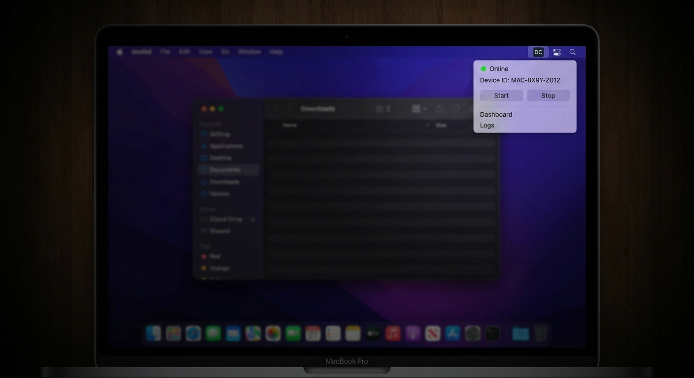
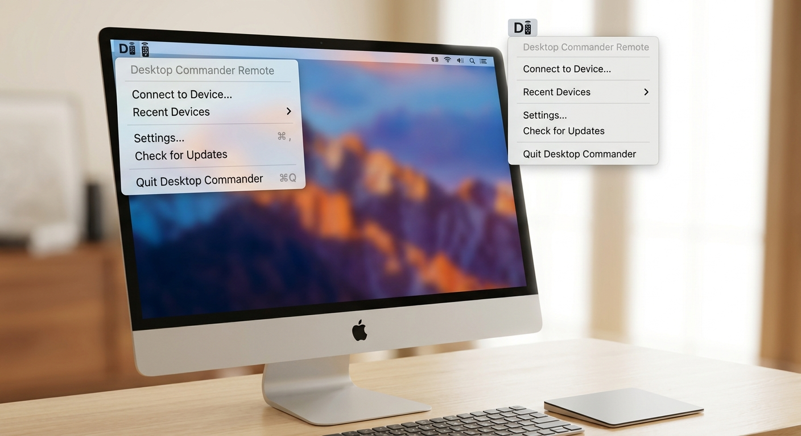
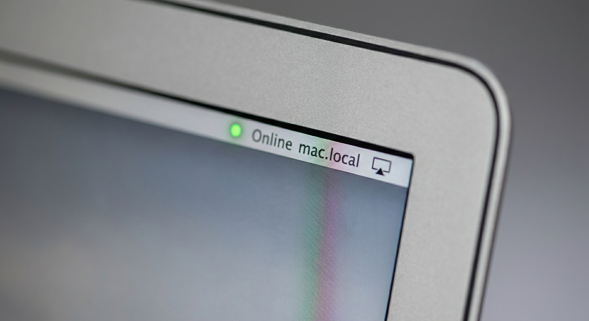
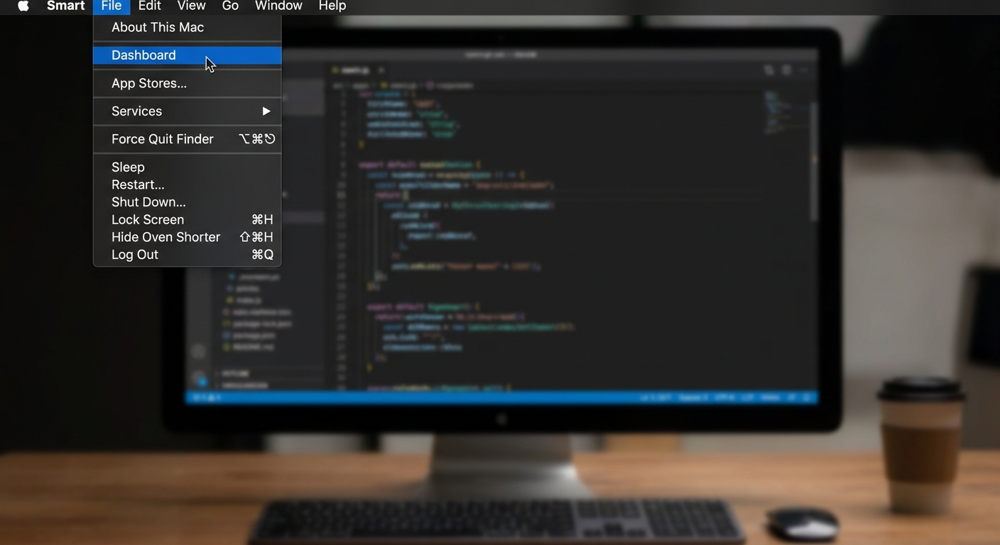

# Desktop Commander Remote 🖥️⚡

[](https://github.com/samihalawa/desktop-commander-remote/releases)
[](./LICENSE)
[](https://github.com/samihalawa/desktop-commander-remote)
[](https://github.com/samihalawa/desktop-commander-remote/releases/latest)

**Your seamless bridge between advanced AI agents and local execution.** Desktop Commander Remote is a lightweight, native macOS menu bar application that connects your local machine to any Model Context Protocol (MCP) compatible AI agent. It allows next-generation AI assistants to safely and securely interact with your local environment, execute commands, and manage resources — all while giving you full visibility and control right from your menu bar.



---

## ✨ Key Features

- **Native macOS Experience** — Built in Swift for Apple Silicon and Intel, featuring a beautiful frosted-glass UI that feels right at home on your Mac
- **Universal AI Integration** — Works flawlessly with *any* AI agent that supports the Model Context Protocol (MCP). No hardcoded dependencies on specific models
- **Real-time Visibility** — Instantly check your connection status, device ID, and active streams with a single click
- **Secure & Controllable** — You hold the keys. Instantly stop, restart, or view logs of your remote connection directly from the menu
- **One-click Start/Stop** — Toggle the remote daemon from the menubar
- **Dashboard Window** — Embedded web UI for device management
- **Auto-launch on Login** — Installs as a macOS LaunchAgent
- **Signed with Developer ID** — No Gatekeeper warnings

---

## 🚀 Quick Install

### Option 1 — DMG (recommended)

1. Download the latest `.dmg` from the [Releases page](https://github.com/samihalawa/desktop-commander-remote/releases/latest)
2. Open the DMG and drag **DCRemoteMenuBar.app** to `/Applications`
3. Launch the app — it appears in your menu bar
4. Click the monitor icon → **Start** to activate the remote daemon

### Option 2 — npm (daemon only)

```bash
npx @wonderwhy-er/desktop-commander setup
```

---

## Usage

### Start the remote device

Click the monitor icon in your menu bar → **Start**

The icon turns green when the daemon is online and your Mac is reachable.

### Connect your AI agent

Add this to your MCP client config:

```json
{
  "mcpServers": {
    "desktop-commander-remote": {
      "command": "npx",
      "args": ["-y", "@wonderwhy-er/desktop-commander"],
      "env": {
        "DEVICE_ID": "your-device-id-here"
      }
    }
  }
}
```

Get your **Device ID** from the menubar: click the monitor icon → **Copy Device ID**.

---

## Screenshots

| Dark Mode | Light Mode |
|---|---|
|  |  |

| Status Glow | Developer Action |
|---|---|
|  |  |

---

## Architecture

```
┌─────────────────────────────────────────┐
│  macOS (your Mac)                        │
│                                         │
│  ┌────────────────┐   ┌───────────────┐ │
│  │ DCRemoteMenuBar│──▶│  Node daemon  │ │
│  │  (Swift .app)  │   │  device.js    │ │
│  └────────────────┘   └───────┬───────┘ │
│                               │ WebSocket│
└───────────────────────────────┼─────────┘
                                ▼
                ┌───────────────────────────┐
                │  mcp.desktopcommander.app  │
                │  (relay / MCP broker)      │
                └───────────────────────────┘
                                ▲
                                │ MCP protocol
                ┌───────────────────────────┐
                │  AI Agent / MCP Client     │
                │  (any machine, anywhere)   │
                └───────────────────────────┘
```

The **menubar app** (Swift) manages the **Node.js daemon** (`dist/remote-device/device.js`) via `launchctl`. The daemon opens a persistent WebSocket to the relay server. AI agents connect to the relay and issue MCP tool calls that the daemon executes locally on your Mac.

---

## Build from Source

### Prerequisites

- macOS 12+
- Xcode Command Line Tools (`xcode-select --install`)
- Node.js 18+

### Build menubar app

```bash
git clone https://github.com/samihalawa/desktop-commander-remote
cd desktop-commander-remote

# Compile Swift menubar app
swiftc menubar/DCRemoteMenuBar.swift \
  -framework Cocoa -framework WebKit \
  -o /tmp/DCRemoteMenuBar.app/Contents/MacOS/DCRemoteMenuBar

# Build Node daemon
npm install && npm run build
```

### Build DMG

```bash
brew install create-dmg
create-dmg \
  --volname "DC Remote MenuBar" \
  --window-size 600 400 \
  --icon "DCRemoteMenuBar.app" 175 190 \
  --app-drop-link 425 190 \
  "DCRemoteMenuBar-1.0.0.dmg" \
  "/path/to/app/folder/"
```

---

## FAQ

**Is this tied to a specific AI model?**
No. Desktop Commander Remote is model-agnostic — it works with any AI agent or LLM that supports the Model Context Protocol (MCP). As new models emerge, this app works with them out of the box.

**Is my data secure?**
Commands are relayed via an encrypted WebSocket. Your device ID is the auth token — keep it private.

**Does the daemon run as a background service?**
Yes — it installs as a macOS LaunchAgent so it survives logout and auto-starts at login.

**Can I use this on Windows/Linux?**
The menubar app is macOS-only. The Node daemon (`device.js`) runs on any platform.

---

## Contributing

PRs welcome. Please read [CONTRIBUTING.md](./.github/CONTRIBUTING.md) first.

1. Fork the repo
2. Create a feature branch: `git checkout -b feat/my-feature`
3. Commit and open a PR

---

## License

MIT — see [LICENSE](./LICENSE)

---

<!-- SEO: remote mac control, macos menu bar app, model context protocol, MCP server mac, AI agent local execution, remote desktop AI, macOS automation AI, MCP remote device, desktop commander remote, ai agent mac controller, local AI tool execution, menubar app swift, mac AI integration -->
